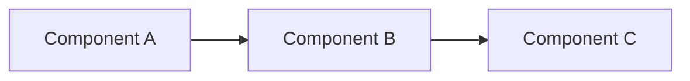

# README Template

Use this as a starting point. Remove sections that don't apply.

---

```markdown
# Project Name

> One-line description of what this project does.

[](link) [](link)


---

## Features

- Feature one
- Feature two
- Feature three

---

## Architecture

<!-- Use Mermaid for GitHub-rendered diagrams -->



---

## Prerequisites

- Runtime (e.g., Python 3.10+, Node 18+)
- External services (e.g., Docker, PostgreSQL)

---

## Installation

```bash
git clone https://github.com/user/project.git
cd project
pip install -r requirements.txt  # or npm install
```

---

## Configuration

Copy the example config and edit:

```bash
cp config.example.yaml config.yaml
```

| Key         | Description              | Default     |
|-------------|--------------------------|-------------|
| `key_name`  | What it controls         | `default`   |

### Environment Variables

```bash
export SECRET_KEY="your-secret"
```

---

## Usage

### Start the Application

```bash
python -m app.main
```

### Frontend (if applicable)

```bash
cd frontend
npm install
npm run dev
```

---

## API Endpoints

| Method | Endpoint         | Description            |
|--------|------------------|------------------------|
| GET    | `/health`        | Health check           |
| GET    | `/api/resource`  | Get resource           |
| POST   | `/api/resource`  | Create resource        |

---

## Docker

```bash
docker-compose up -d
```

Or run individually:

```bash
docker run -d --name service -p 8080:8080 image:tag
```

---

## Testing

```bash
pytest
```

---

## Project Structure

```
project/
├── src/           # Source code
├── tests/         # Test suite
├── docs/          # Documentation
├── docker/        # Docker configs
└── README.md
```

---

## Contributing

1. Fork the repo
2. Create a feature branch
3. Submit a pull request

---

## Roadmap

- [ ] Planned feature one
- [ ] Planned feature two

---

## License

MIT
```
