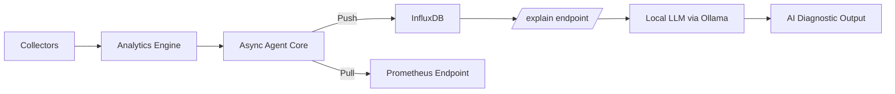

# 🚀 NetMonitor

> Async Network Monitoring Agent with AI-Assisted Diagnostics

NetMonitor is a modular, production-oriented network monitoring agent designed to explore modern observability architecture with optional local AI analysis.

It combines deterministic telemetry collection with a local LLM-based diagnostic layer.

---

## ✨ Features

* ⚡ Async monitoring engine
* 📊 InfluxDB (push) + Prometheus (pull) exporters
* 🧠 Optional local LLM-based analysis (Ollama)
* ❤️ Agent health state tracking
* 🧩 Plugin-based collector system
* 🔒 Schema-safe metric normalization
* ⚙️ Typed configuration (Pydantic + YAML)
* 🌐 FastAPI server integration
* 🎨 React-based real-time dashboard
* 📡 Event tracking (timeouts, packet loss, jitter)
* 🎯 Dynamic target configuration
* 🐳 Docker-compatible

---

# 🏗 Architecture



---

# 🧠 Design Principles

NetMonitor separates:

| Layer      | Responsibility                     |
| ---------- | ---------------------------------- |
| Collectors | Raw telemetry                      |
| Analytics  | Derived metrics (rolling mean/std) |
| Agent Core | Async orchestration                |
| Exporters  | Storage adapters                   |
| API        | Observability endpoints            |
| AI Layer   | Human-readable interpretation      |

The AI layer is **fully decoupled** from the monitoring loop.

---

# 📁 Project Structure

```
netmonitor/
│
├── app/
│   ├── core/          # Agent & health state
│   ├── collectors/    # Metric producers (ping, traffic)
│   ├── analytics/     # Derived metrics (latency stats, scoring, stability)
│   ├── exporters/     # Influx + Prometheus
│   ├── api/           # FastAPI server
│   ├── ai/            # LLM integration
│   ├── config/        # Typed configuration
│   └── utils/         # Logging utilities
│
├── frontend/          # React dashboard
│   ├── src/
│   │   ├── components/   # UI components
│   │   └── App.jsx       # Main app
│   └── index.html
│
├── README.md
└── requirements.txt
```

---

# ⚙️ Installation

## 1️⃣ Clone

```bash
git clone https://github.com/your-username/netmonitor.git
cd netmonitor
```

## 2️⃣ Install Dependencies

```bash
pip install -r requirements.txt
```

---

# 🗄 InfluxDB Setup (Docker)

```bash
docker run -d \
  --name influxdb \
  -p 8086:8086 \
  influxdb:2
```

Create:

* Organization
* Bucket (must match `config.yaml`)
* API token

Set token (Windows):

```bash
setx INFLUX_TOKEN "your_token_here"
```

Restart terminal afterward.

---

# 📊 Optional: Grafana

```bash
docker run -d \
  --name grafana \
  -p 3000:3000 \
  grafana/grafana
```

Add InfluxDB or Prometheus as data source.

---

# 🧠 Optional AI Setup (Local LLM)

Install Ollama:

👉 [https://ollama.com/download](https://ollama.com/download)

Pull a lightweight model:

```bash
ollama pull phi3
```

Test:

```bash
ollama run phi3
```

Ollama runs locally at:

```
http://localhost:11434
```

No cloud required.

---

# 🚀 Run the Application

## Backend (Agent + API)

```bash
python -m app.main
```

The backend will start on port 8000 by default.

## Frontend Dashboard

```bash
cd frontend
npm install
npm run dev
```

The dashboard will start on port 5173 and connect to the backend API.

---

# 🌐 API Endpoints

## Health & Status

### Agent Health

```
GET /health
```

Returns:

* Agent state
* Last error
* Consecutive failures

### Agent Status (Dashboard)

```
GET /api/agent/status?window=5m
```

Returns formatted status for dashboard display.

---

## Metrics

### Latest Metrics

```
GET /api/metrics
```

Returns current metrics:

* Latency, packet loss, jitter, delay spread
* Rolling mean/std latency
* Timestamp and agent ID

### Metrics History

```
GET /api/metrics/history
```

Returns time-series data for charts.

### Prometheus Metrics

```
GET /metrics
```

Prometheus-compatible metric export for scraping.

---

## Events

### Get Events

```
GET /api/events
```

Returns network event counters:

* Timeout events
* Packet loss events
* High jitter events

### Reset Events

```
POST /api/events/reset
```

Resets all event counters.

---

## Target Configuration

### Get Current Target

```
GET /api/target
```

Returns the current ping target being monitored.

### Set Target

```
POST /api/target
```

Dynamically change the monitoring target without restart.

---

## AI Diagnostic Explanation

```
GET /explain?window=30
```

Workflow:

1. Query recent metrics from InfluxDB
2. Compute statistical summary
3. Send structured summary to local LLM
4. Return technical interpretation

Example output:

> "Latency variance increased significantly in the last 30 minutes with intermittent packet loss, suggesting transient congestion rather than persistent link degradation."

---

# 🎨 Frontend Dashboard

The React-based dashboard provides real-time monitoring with:

* **Live Metrics Display**: Latency, packet loss, jitter, delay spread
* **Network Charts**: Time-series visualization of key metrics
* **AI Insights Panel**: LLM-generated diagnostics and recommendations
* **Operational Status**: Agent health state and current target
* **Event Tracking**: Visual counters for timeouts, packet loss, jitter spikes
* **Alert Panel**: Real-time alerts based on network conditions
* **Responsive UI**: Built with React + TailwindCSS

Access at: `http://localhost:5173` (when frontend is running)

---

# 📊 Health State Model

Agent states:

* `starting`
* `running`
* `degraded`
* `error`
* `stopped`

Health transitions automatically based on collector/exporter failures.

---

# 📡 Event Tracking System

The agent tracks and counts network anomalies:

* **Timeout Events**: Failed ping requests
* **Packet Loss Events**: Significant packet loss detected
* **High Jitter Events**: Jitter exceeding thresholds

Events are exposed via API and displayed in the dashboard.

---

# 🎯 Dynamic Target Configuration

Change monitoring targets on-the-fly:

```bash
curl -X POST http://localhost:8000/api/target?target=google.com
```

No restart required. The agent immediately switches to the new target.

---

# 🛡 Schema Safety

All numeric metrics are normalized to float before writing to InfluxDB to prevent field-type conflicts.

Measurement:

```
network_metrics
```

Tags:

* `agent_id`

---

# � Analytics Engine

The analytics layer processes raw telemetry into actionable insights:

* **Latency Stats** (`latency_stats.py`): Rolling mean, standard deviation, percentiles
* **Scoring** (`scoring.py`): Network quality scoring algorithms
* **Stability** (`stability.py`): Connection stability assessment

Metrics are computed in real-time and exported to InfluxDB/Prometheus.

---

# 🔬 Engineering Highlights

This project demonstrates:

* Async concurrency with asyncio
* Thread-wrapped blocking collectors
* Clean dependency injection
* Typed configuration (Pydantic + YAML)
* Push vs pull monitoring models
* Health state orchestration
* Local LLM integration without cloud dependency
* Real-time frontend with React
* Event-driven architecture
* RESTful API design
* Observability-first system design

---

# 🚧 Roadmap

* 🔍 Anomaly scoring engine
* 📈 Trend detection (EMA, slope)
* 🧾 AI-generated PDF reports
* 🌍 Multi-agent distributed mode
* 🔔 Alert explanation engine
* 🛡 Export retry/backoff strategy
* 📊 Health metrics exported to Prometheus

---

# 📜 License

MIT

---

# 🎯 Positioning

NetMonitor is not meant to replace Prometheus or InfluxDB.

It is a research-oriented monitoring agent exploring:

* Observability architecture
* Time-series modeling
* Health-aware orchestration
* AI-assisted diagnostics

---

