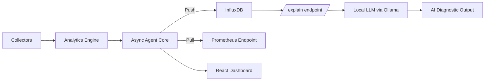

# NetMonitor

> Async network monitoring agent with AI-assisted diagnostics

NetMonitor is a modular, production-oriented network monitoring agent designed to explore modern observability architecture with optional local AI analysis. It combines deterministic telemetry collection with a local LLM-based diagnostic layer.

---


---

## Features

- **Async monitoring engine** — concurrent collectors with `asyncio`
- **Dual exporters** — InfluxDB (push) + Prometheus (pull)
- **Local AI diagnostics** — optional LLM analysis via Ollama (no cloud required)
- **Agent health tracking** — automatic state transitions (starting → running → degraded → error → stopped)
- **Plugin-based collectors** — ping, traffic, iPerf (extensible)
- **Analytics engine** — rolling mean/std, network scoring, stability analysis
- **Schema-safe metrics** — all numerics normalized to float before InfluxDB write
- **Typed configuration** — Pydantic models + YAML config with environment overrides
- **FastAPI server** — REST API for metrics, events, health, target management
- **React dashboard** — real-time charts, AI insights, alerts, event tracking
- **Dynamic target** — change monitored host at runtime without restart
- **Event tracking** — timeout, packet loss, and high jitter counters
- **Docker-ready** — Dockerfile included

---

## Architecture



| Layer      | Responsibility                          |
| ---------- | --------------------------------------- |
| Collectors | Raw telemetry (ping, traffic, iPerf)    |
| Analytics  | Derived metrics (rolling mean/std, scoring, stability) |
| Agent Core | Async orchestration + health state      |
| Exporters  | InfluxDB + Prometheus adapters          |
| API        | FastAPI endpoints                       |
| AI Layer   | LLM-based diagnostic interpretation    |
| Frontend   | React + TailwindCSS dashboard           |

---

## Prerequisites

- **Python 3.11+**
- **Node.js 18+** (for the frontend dashboard)
- **Docker** (optional, for InfluxDB / Grafana / Ollama)

---

## Installation

```bash
git clone https://github.com/your-username/netmonitor.git
cd netmonitor
```

### Backend

```bash
python -m venv .venv

# Windows
.venv\Scripts\activate

# macOS/Linux
source .venv/bin/activate

pip install -r requirements.txt
```

### Frontend

```bash
cd frontend
npm install
```

---

## Configuration

Configuration is defined in `app/config/config.yaml`:

```yaml
agent:
  id: "agent-001"
  location: "lab"
  environment: "dev"

interval: 10

exporters:
  influx:
    enabled: false
    url: "http://localhost:8086"
    org: "net-monitor"
    bucket: "network"

  prometheus:
    enabled: true
    port: 8000
```

### Environment Variable Overrides

| Variable       | Overrides               |
| -------------- | ----------------------- |
| `AGENT_ID`     | `agent.id`              |
| `INTERVAL`     | `interval`              |
| `INFLUX_URL`   | `exporters.influx.url`  |
| `INFLUX_TOKEN` | InfluxDB API token      |

For full configuration reference, see [docs/CONFIGURATION.md](docs/CONFIGURATION.md).

---

## Usage

### Backend (Agent + API)

```bash
python -m app.main
```

The backend starts on port **8000** by default (configured via `exporters.prometheus.port`).

### Frontend Dashboard

```bash
cd frontend
npm run dev
```

The dashboard starts on **http://localhost:5173** and connects to the backend API.

---

---

## API Endpoints

### Health & Status

| Method | Endpoint                      | Description                           |
| ------ | ----------------------------- | ------------------------------------- |
| GET    | `/health`                     | Agent health (state, errors, failures)|
| GET    | `/api/agent/status?window=5m` | Formatted status for dashboard        |

### Metrics

| Method | Endpoint               | Description                            |
| ------ | ---------------------- | -------------------------------------- |
| GET    | `/api/metrics`         | Latest metrics (latency, loss, jitter) |
| GET    | `/api/metrics/history` | Time-series data for charts            |
| GET    | `/metrics`             | Prometheus-compatible scrape endpoint  |

### Events

| Method | Endpoint            | Description              |
| ------ | ------------------- | ------------------------ |
| GET    | `/api/events`       | Network event counters   |
| POST   | `/api/events/reset` | Reset all event counters |

### Target Configuration

| Method | Endpoint       | Description                   |
| ------ | -------------- | ----------------------------- |
| GET    | `/api/target`  | Get current monitoring target |
| POST   | `/api/target`  | Change target at runtime      |

```bash
curl -X POST "http://localhost:8000/api/target?target=google.com"
```

### AI Diagnostic

| Method | Endpoint             | Description                              |
| ------ | -------------------- | ---------------------------------------- |
| GET    | `/explain?window=30` | LLM-generated analysis of recent metrics |

Queries InfluxDB for recent data, computes a statistical summary, and sends it to the local LLM for interpretation.

For full API documentation, see [docs/API.md](docs/API.md).

---

## Testing

```bash
pytest
```

Test coverage includes: config loading, collectors, exporters, analytics, and main entry point.

---

## Docker

### Dockerfile

Build and run the agent in a container:

```bash
docker build -t netmonitor -f docker/Dockerfile .
docker run -d --name netmonitor -p 8000:8000 netmonitor
```

### External Services

#### InfluxDB

```bash
docker run -d \
  --name influxdb \
  -p 8086:8086 \
  influxdb:2
```

After starting, create an organization, bucket (matching `config.yaml`), and API token via the InfluxDB UI at `http://localhost:8086`.

Set token (Windows):

```bash
setx INFLUX_TOKEN "your_token_here"
```

#### Grafana (Optional)

```bash
docker run -d \
  --name grafana \
  -p 3000:3000 \
  -e GF_SECURITY_ADMIN_PASSWORD=changeme123 \
  grafana/grafana
```

Access at: **http://localhost:3000**
Default login: `admin` / `changeme123`

**Add Prometheus data source:**

1. Go to **Connections → Data Sources → Add data source**
2. Select **Prometheus**
3. Set URL to `http://host.docker.internal:8000` (or `http://localhost:8000` if running natively)
4. Click **Save & Test**

**Add InfluxDB data source (if enabled):**

1. Go to **Connections → Data Sources → Add data source**
2. Select **InfluxDB** → Query Language: **Flux**
3. URL: `http://host.docker.internal:8086`
4. Organization: `net-monitor`, Token: your `INFLUX_TOKEN`, Bucket: `network`
5. Click **Save & Test**

**Suggested dashboard panels:**

| Panel                | Metric                    | Type        |
| -------------------- | ------------------------- | ----------- |
| Latency              | `latency_ms`              | Time series |
| Packet Loss          | `packet_loss`             | Time series |
| Jitter               | `jitter_ms`               | Time series |
| Delay Spread         | `delay_spread_ms`         | Time series |
| Rolling Mean Latency | `rolling_mean_latency_ms` | Time series |
| Rolling Std Latency  | `rolling_std_latency_ms`  | Stat        |
| Network Score        | `network_score`           | Gauge       |

#### Ollama (Optional — Local AI)

Install from [ollama.com/download](https://ollama.com/download), or run via Docker:

```bash
docker run -d --name ollama -p 11434:11434 ollama/ollama
```

Pull a model:

```bash
ollama pull phi3
```

Ollama runs locally at `http://localhost:11434`. No cloud required.

---

## Project Structure

```
netmonitor/
├── app/
│   ├── main.py              # Entry point
│   ├── influx_client.py     # InfluxDB client wrapper
│   ├── core/
│   │   ├── agent.py         # Async agent orchestration
│   │   ├── health.py        # Health state machine
│   │   ├── scheduler.py     # Task scheduling
│   │   └── plugin_manager.py
│   ├── collectors/
│   │   ├── base.py          # BaseCollector interface
│   │   ├── ping.py          # ICMP ping collector
│   │   ├── traffic.py       # Network traffic (psutil)
│   │   └── iperf.py         # iPerf collector
│   ├── analytics/
│   │   ├── latency_stats.py # Rolling mean, std, percentiles
│   │   ├── scoring.py       # Network quality scoring
│   │   └── stability.py     # Connection stability analysis
│   ├── exporters/
│   │   ├── base.py          # BaseExporter interface
│   │   ├── influx.py        # InfluxDB push exporter
│   │   ├── prometheus.py    # Prometheus pull exporter
│   │   └── manager.py       # Exporter loader
│   ├── api/
│   │   ├── server.py        # FastAPI app + routes
│   │   └── routes.py        # Route definitions
│   ├── ai/
│   │   └── analyzer.py      # LLM integration (Ollama)
│   ├── config/
│   │   ├── config.yaml      # YAML configuration
│   │   ├── config.py        # Legacy config helpers
│   │   ├── loader.py        # Settings loader
│   │   └── models.py        # Pydantic models
│   └── utils/
│       ├── logger.py        # Logging setup
│       └── exceptions.py    # Custom exceptions
├── frontend/
│   ├── index.html
│   ├── package.json
│   └── src/
│       ├── App.jsx
│       ├── main.jsx
│       ├── index.css
│       └── components/
│           ├── AIInsightsPanel.jsx
│           ├── AlertsPanel.jsx
│           ├── Header.jsx
│           ├── LogStatusPanel.jsx
│           ├── MetricsCard.jsx
│           ├── NetworkChart.jsx
│           ├── OperationalStatusPanel.jsx
│           └── PacketLossEventsPanel.jsx
├── docker/
│   ├── Dockerfile
│   └── docker-compose.yml
├── docs/                    # Extended documentation
├── tests/                   # pytest test suite
├── logs/                    # Runtime logs
├── requirements.txt
└── README.md
```

---

## Documentation

Extended documentation is available in the [docs/](docs/) folder:

| Document | Description |
| -------- | ----------- |
| [Quickstart](docs/QUICKSTART.md) | Get running in 5 minutes |
| [Architecture](docs/ARCHITECTURE.md) | System design overview |
| [Configuration](docs/CONFIGURATION.md) | All config options |
| [Collectors](docs/COLLECTORS.md) | Collector plugin system |
| [Exporters](docs/EXPORTERS.md) | InfluxDB + Prometheus setup |
| [API](docs/API.md) | Full API reference |
| [AI Integration](docs/AI_INTEGRATION.md) | Ollama / LLM setup |
| [Agent Core](docs/AGENT_CORE.md) | Agent lifecycle + health |
| [Design Principles](docs/DESIGN_PRINCIPLES.md) | Architecture decisions |
| [Deployment](docs/DEPLOYMENT.md) | Production deployment |
| [Development](docs/DEVELOPMENT.md) | Developer guide |
| [Troubleshooting](docs/TROUBLESHOOTING.md) | Common issues |
| [FAQ](docs/FAQ.md) | Frequently asked questions |

---

## Roadmap

- Anomaly scoring engine
- Trend detection (EMA, slope)
- AI-generated PDF reports
- Multi-agent distributed mode
- Alert explanation engine
- Export retry/backoff strategy
- Health metrics exported to Prometheus

---

## License

MIT

---

## Positioning

NetMonitor is not meant to replace Prometheus or InfluxDB. It is a research-oriented monitoring agent exploring observability architecture, time-series modeling, health-aware orchestration, and AI-assisted diagnostics.

