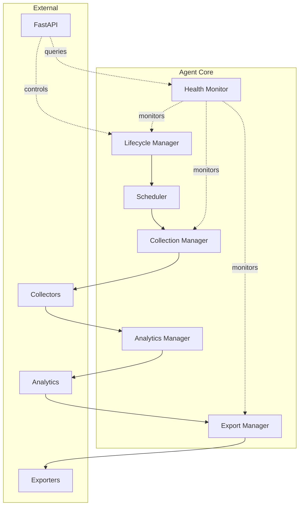
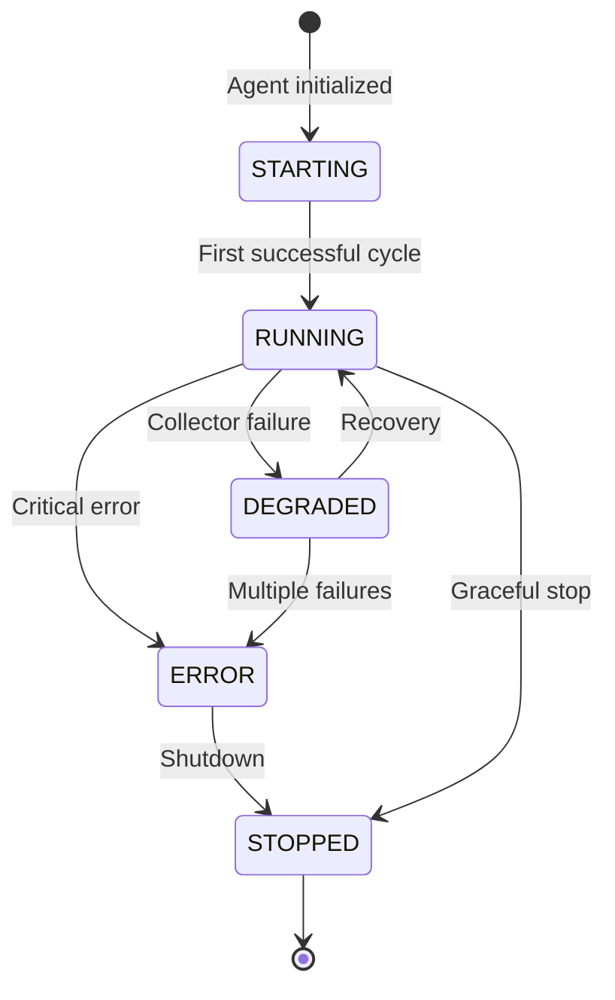
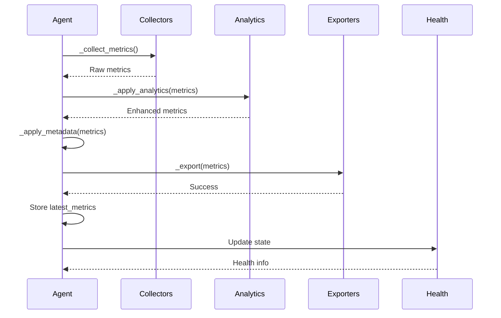

# Agent Core Documentation

> In-depth guide to NetMonitor's core agent orchestration engine

## 🎯 Overview

The Agent is the central orchestration component of NetMonitor. It manages the complete lifecycle of metric collection, analytics, export, and health monitoring.

**Location:** `app/core/agent.py`
**Key Responsibilities:**
- Schedule and coordinate collection cycles
- Manage collector execution
- Apply analytics pipeline
- Dispatch to exporters
- Track health state
- Handle errors and recovery
- Manage graceful shutdown

---

## 🏗️ Agent Architecture



---

## 📋 Agent Class Structure

### Core Components

```python
class Agent:
    """Main orchestration engine"""
    
    def __init__(
        self,
        agent_id: str,
        collectors: List[BaseCollector],
        exporters: List[BaseExporter],
        interval: int = 10
    ):
        # Identity
        self.agent_id = agent_id
        self.interval = interval
        
        # Components
        self.collectors = collectors
        self.exporters = exporters
        
        # Analytics
        self.stability = StabilityAnalyzer()
        
        # State
        self.health = AgentHealth()
        self.events = NetworkEvents()
        self.latest_metrics = {}
        
        # Runtime
        self._running = False
        self.current_target = "8.8.8.8"
        self._target_lock = Lock()
```

---

## 🔄 Lifecycle Management

### States

```python
class AgentState(Enum):
    """Agent operational states"""
    STARTING = "starting"
    RUNNING = "running"
    DEGRADED = "degraded"
    ERROR = "error"
    STOPPED = "stopped"
```

### State Transitions



### Lifecycle Methods

#### start()

Starts the agent and enters the main collection loop:

```python
async def start(self):
    """
    Start agent and run collection loop.
    
    This is the main entry point that:
    1. Initializes agent state
    2. Runs collection cycles
    3. Handles errors
    4. Ensures cleanup on exit
    """
    logger.info(f"Agent {self.agent_id} starting...")
    self._running = True
    self.health.state = AgentState.STARTING
    
    try:
        while self._running:
            await self._cycle()
            self.health.last_cycle = datetime.utcnow()
            await asyncio.sleep(self.interval)
    
    except asyncio.CancelledError:
        logger.info("Agent task cancelled")
    except Exception as e:
        logger.critical(f"Agent crashed: {e}")
        self.health.mark_error(str(e))
        raise
    finally:
        await self.shutdown()
```

#### shutdown()

Gracefully shuts down the agent:

```python
async def shutdown(self):
    """
    Graceful shutdown procedure.
    
    Ensures:
    - Collection stops
    - Exporters flush
    - Resources released
    """
    logger.info(f"Agent {self.agent_id} shutting down...")
    self._running = False
    self.health.mark_stopped()
    
    # Future: Close exporter connections
    # Future: Flush pending writes
```

#### stop()

External stop trigger:

```python
def stop(self):
    """
    Stop agent from external trigger (API/signal).
    Sets flag for graceful shutdown in next cycle.
    """
    logger.info("Stop requested")
    self._running = False
```

---

## 🔁 Collection Cycle

### Cycle Flow



### _cycle() Method

```python
async def _cycle(self):
    """
    Single collection cycle.
    
    Steps:
    1. Collect from all collectors (concurrent)
    2. Apply analytics transformations
    3. Add agent metadata
    4. Export to all backends (concurrent)
    5. Update health state
    """
    # 1. Collect
    metrics = await self._collect_metrics()
    
    if not metrics:
        logger.warning("No metrics collected this cycle")
        self.health.mark_degraded("No metrics collected")
        return
    
    # 2. Analytics
    self._apply_analytics(metrics)
    
    # 3. Metadata
    self._apply_metadata(metrics)
    
    # 4. Export
    await self._export(metrics)
    
    # 5. Store & update health
    self.latest_metrics = metrics.copy()
    
    if self.health.state != AgentState.ERROR:
        self.health.mark_running()
```

---

## 📥 Collection Management

### _collect_metrics()

Executes all collectors concurrently:

```python
async def _collect_metrics(self) -> dict:
    """
    Collect metrics from all registered collectors.
    
    Features:
    - Concurrent execution via asyncio.gather
    - Error isolation (one collector failure doesn't stop others)
    - Dynamic target injection for ping collector
    
    Returns:
        dict: Merged metrics from all collectors
    """
    target = self.get_target()
    tasks = []
    
    for collector in self.collectors:
        # Special handling for ping collector
        if hasattr(collector, 'collect') and collector.name == 'ping':
            tasks.append(asyncio.to_thread(collector.collect, target))
        else:
            tasks.append(asyncio.to_thread(collector.collect))
    
    # Execute concurrently
    results = await asyncio.gather(*tasks, return_exceptions=True)
    
    # Merge results
    metrics = {}
    for collector, result in zip(self.collectors, results):
        if isinstance(result, Exception):
            error_msg = f"Collector {collector.name} failed: {result}"
            logger.error(error_msg)
            self.health.mark_degraded(error_msg)
        elif isinstance(result, dict):
            metrics.update(result)
    
    return metrics
```

### Error Handling

Collectors run in isolation—one failure doesn't affect others:

```python
# Collector A succeeds
{
    "latency": 15.3,
    "packet_loss": 0
}

# Collector B fails → logged but agent continues
# Error: "Collector traffic failed: Connection timeout"

# Final metrics (only successful collectors)
{
    "latency": 15.3,
    "packet_loss": 0
}
```

---

## 📊 Analytics Pipeline

### _apply_analytics()

Applies analytics transformations to raw metrics:

```python
def _apply_analytics(self, metrics: dict):
    """
    Apply analytics transformations to metrics.
    
    Adds:
    - Rolling statistics (mean, std dev)
    - Stability scores
    - Trend detection
    - Anomaly flags
    
    Modifies metrics dict in-place.
    """
    # Latency statistics
    if "latency" in metrics and metrics["latency"] is not None:
        stats = self.stability.update_latency(metrics["latency"])
        metrics.update(stats)
    
    # Stability analysis
    stability_score = self.stability.calculate_stability(metrics)
    metrics["stability_score"] = stability_score
    
    # Event tracking
    self._track_events(metrics)
```

### Event Tracking

```python
def _track_events(self, metrics: dict):
    """
    Track notable network events.
    
    Events:
    - Timeouts
    - Packet loss
    - High jitter
    """
    target = self.get_target()
    
    # Timeout detection
    if metrics.get("latency") is None:
        self.events.record_timeout(target)
    
    # Packet loss detection
    if metrics.get("packet_loss", 0) > 0:
        self.events.record_packet_loss(
            target,
            metrics["packet_loss"]
        )
    
    # High jitter detection
    if metrics.get("jitter", 0) > 10:
        self.events.record_high_jitter(
            target,
            metrics["jitter"]
        )
```

---

## 🏷️ Metadata Application

### _apply_metadata()

Adds contextual metadata to metrics:

```python
def _apply_metadata(self, metrics: dict):
    """
    Add agent metadata to metrics.
    
    Adds:
    - agent_id: Agent identifier
    - timestamp: Collection time
    - location: Agent location (from config)
    - environment: Deployment environment
    """
    metrics["agent_id"] = self.agent_id
    metrics["timestamp"] = datetime.utcnow().isoformat()
    
    # Future: Add from configuration
    # metrics["location"] = self.config.location
    # metrics["environment"] = self.config.environment
```

---

## 📤 Export Management

### _export()

Dispatches metrics to all configured exporters:

```python
async def _export(self, metrics: dict):
    """
    Export metrics to all configured backends.
    
    Features:
    - Concurrent export to all exporters
    - Error isolation
    - Async execution
    """
    if not self.exporters:
        return
    
    tasks = []
    for exporter in self.exporters:
        tasks.append(asyncio.to_thread(exporter.export, metrics))
    
    results = await asyncio.gather(*tasks, return_exceptions=True)
    
    for exporter, result in zip(self.exporters, results):
        if isinstance(result, Exception):
            logger.error(f"Export to {exporter.__class__.__name__} failed: {result}")
```

---

## ❤️ Health Monitoring

### AgentHealth Class

```python
class AgentHealth:
    """Track agent health state"""
    
    def __init__(self):
        self.state = AgentState.STOPPED
        self.last_error = None
        self.last_cycle = None
        self.consecutive_failures = 0
        self.start_time = datetime.utcnow()
    
    def mark_running(self):
        """Mark agent as healthy"""
        self.state = AgentState.RUNNING
        self.consecutive_failures = 0
        self.last_error = None
    
    def mark_degraded(self, reason: str):
        """Mark agent as degraded"""
        self.state = AgentState.DEGRADED
        self.last_error = reason
        self.consecutive_failures += 1
        
        # Escalate to ERROR if persistent
        if self.consecutive_failures >= 5:
            self.mark_error(reason)
    
    def mark_error(self, reason: str):
        """Mark agent in error state"""
        self.state = AgentState.ERROR
        self.last_error = reason
    
    def mark_stopped(self):
        """Mark agent as stopped"""
        self.state = AgentState.STOPPED
    
    def to_dict(self) -> dict:
        """Health status dictionary"""
        return {
            "state": self.state.value,
            "last_error": self.last_error,
            "last_cycle": self.last_cycle.isoformat() if self.last_cycle else None,
            "consecutive_failures": self.consecutive_failures,
            "uptime": (datetime.utcnow() - self.start_time).total_seconds()
        }
```

---

## 🎮 Runtime Control

### Dynamic Target Changes

```python
def set_target(self, target: str):
    """
    Change ping target at runtime.
    Thread-safe operation with lock.
    """
    with self._target_lock:
        self.current_target = target
        logger.info(f"Ping target changed to: {target}")

def get_target(self):
    """Get current ping target"""
    with self._target_lock:
        return self.current_target
```

### Usage via API

```python
# In app/api/server.py
@app.post("/api/target")
async def change_target(request: dict):
    new_target = request["target"]
    agent.set_target(new_target)
    return {"success": True, "target": new_target}
```

---

## 🔗 Related Documentation

- **[Architecture](ARCHITECTURE.md)** - System design
- **[Health Monitoring](MONITORING.md)** - Health tracking details
- **[API Reference](API.md)** - Agent control endpoints
- **[Development](DEVELOPMENT.md)** - Contributing to agent core