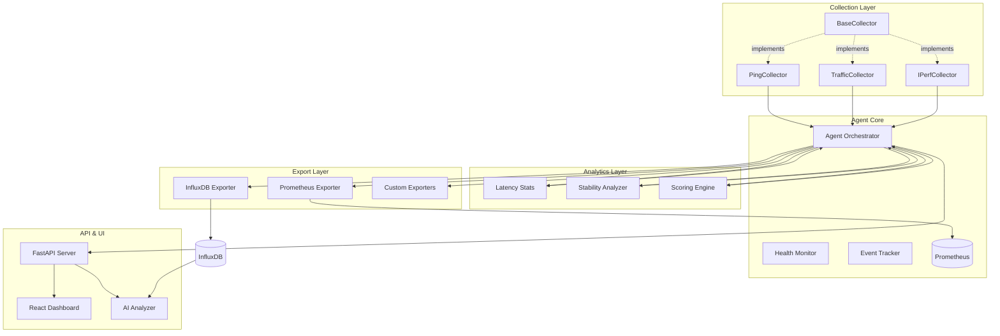
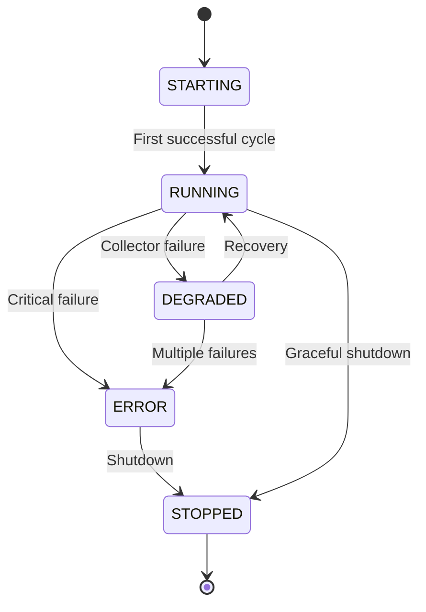
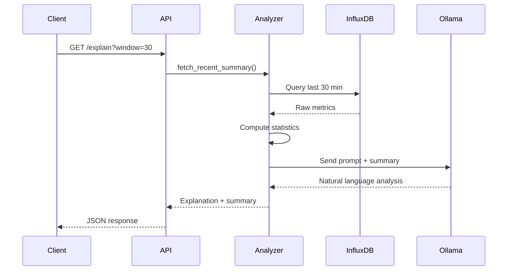
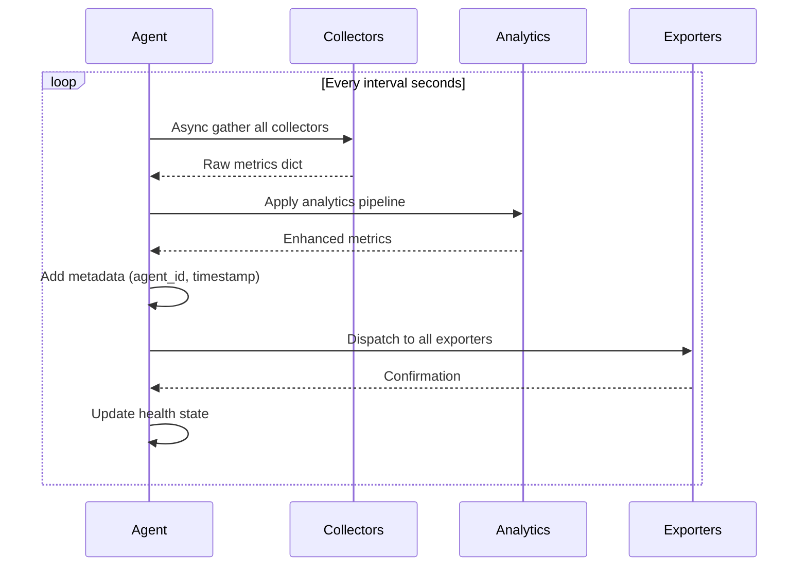

# NetMonitor Architecture

> Comprehensive system architecture and design documentation

## 🏗️ System Overview

NetMonitor is a modular, async-first network monitoring platform built on several core principles: separation of concerns, pluggable architecture, and observable-by-design.



---

## 🎯 Design Principles

### 1. Separation of Concerns

NetMonitor is organized into distinct layers, each with clear responsibilities:

| Layer | Responsibility | Examples |
|-------|---------------|----------|
| **Collection** | Raw telemetry gathering | PingCollector, TrafficCollector |
| **Analytics** | Derived metrics & statistics | Latency stats, stability scoring |
| **Orchestration** | Lifecycle & coordination | Agent core, scheduler |
| **Export** | Data persistence | InfluxDB, Prometheus exporters |
| **Presentation** | API & UI | FastAPI server, React dashboard |
| **Intelligence** | AI-assisted analysis | LLM integration via Ollama |

### 2. Async-First Architecture

All I/O operations are asynchronous to maximize throughput:

```python
async def _cycle(self):
    # Concurrent collection from multiple sources
    metrics = await self._collect_metrics()
    
    # Non-blocking analytics
    self._apply_analytics(metrics)
    
    # Async export to multiple backends
    await self._export(metrics)
```

### 3. Plugin-Based Extensibility

Collectors and exporters follow a plugin pattern:

```python
class BaseCollector(ABC):
    @abstractmethod
    def collect(self) -> dict:
        pass
```

New collectors are auto-discovered and loaded at runtime.

### 4. Observable by Design

Every component provides observability:
- Health state tracking
- Event logging
- Metrics about metrics
- Error propagation

---

## 📦 Component Architecture

### Agent Core

The `Agent` class is the central orchestrator:

**Responsibilities:**
- Schedule collection cycles
- Coordinate collectors
- Apply analytics pipeline
- Dispatch to exporters
- Track health state
- Manage lifecycle

**Key Components:**

```python
class Agent:
    def __init__(self, agent_id, collectors, exporters, interval):
        self.stability = StabilityAnalyzer()
        self.health = AgentHealth()
        self.events = NetworkEvents()
        self.latest_metrics = {}
```

**Lifecycle States:**



### Collection Layer

#### BaseCollector Interface

All collectors implement the `BaseCollector` abstract base class:

```python
from abc import ABC, abstractmethod

class BaseCollector(ABC):
    name: str
    
    @abstractmethod
    def collect(self) -> dict:
        """Return dictionary of metrics"""
        pass
```

#### Built-in Collectors

**PingCollector**
- Measures ICMP latency
- Detects packet loss
- Calculates jitter
- Supports dynamic targets

**TrafficCollector**
- Network interface statistics
- Bytes sent/received
- Packet counts
- Error rates

**IPerfCollector**
- Bandwidth testing
- TCP/UDP throughput
- Bidirectional tests
- Server-based measurement

#### Plugin Discovery

Collectors are auto-loaded from `app/collectors/`:

```python
def load_plugins() -> List[BaseCollector]:
    """Dynamically load all collector plugins"""
    collectors = []
    for file in os.listdir('app/collectors'):
        if file.endswith('.py') and not file.startswith('_'):
            # Import and instantiate
            pass
    return collectors
```

### Analytics Layer

#### Latency Statistics

Rolling window statistical analysis:

```python
class LatencyStats:
    def __init__(self, window_size=20):
        self.window = deque(maxlen=window_size)
    
    def update(self, latency):
        self.window.append(latency)
        return {
            'mean': statistics.mean(self.window),
            'stdev': statistics.stdev(self.window),
            'p95': percentile(self.window, 0.95)
        }
```

**Metrics Produced:**
- Rolling mean latency
- Standard deviation
- Min/max values
- Percentiles (p50, p95, p99)

#### Stability Analyzer

Detects network stability issues:

```python
class StabilityAnalyzer:
    def analyze(self, metrics) -> dict:
        return {
            'is_stable': self._check_stability(metrics),
            'variance': self._calculate_variance(metrics),
            'trend': self._detect_trend(metrics)
        }
```

**Detection Capabilities:**
- High variance detection
- Trend analysis (improving/degrading)
- Anomaly detection
- Baseline deviation

#### Scoring Engine

Produces composite health scores:

```python
def calculate_score(metrics) -> float:
    """
    0-100 score based on:
    - Latency (40% weight)
    - Packet loss (40% weight)
    - Jitter (20% weight)
    """
    pass
```

### Export Layer

#### BaseExporter Interface

```python
class BaseExporter(ABC):
    @abstractmethod
    def export(self, metrics: dict):
        """Send metrics to backend"""
        pass
```

#### InfluxDB Exporter

Push-based time-series storage:

```python
class InfluxExporter(BaseExporter):
    def export(self, metrics: dict):
        point = Point("network_metrics")
        for key, value in metrics.items():
            if isinstance(value, (int, float)):
                point = point.field(key, float(value))
        self.write_api.write(bucket=self.bucket, record=point)
```

**Features:**
- Async batch writes
- Tag-based organization
- Automatic time stamping
- Error handling & retry

#### Prometheus Exporter

Pull-based metrics exposition:

```python
class PrometheusExporter(BaseExporter):
    def __init__(self):
        self.latency = Gauge('network_latency_ms', 'Ping latency')
        self.packet_loss = Gauge('network_packet_loss', 'Packet loss %')
    
    def export(self, metrics: dict):
        self.latency.set(metrics['latency'])
        self.packet_loss.set(metrics['packet_loss'])
```

**Advantages:**
- Standard Prometheus format
- Built-in federation
- Service discovery compatible
- Grafana integration

### API Layer

FastAPI-based REST API with lifespan management:

```python
@asynccontextmanager
async def lifespan(app: FastAPI):
    # Startup: Launch agent
    agent_task = asyncio.create_task(agent.start())
    yield
    # Shutdown: Clean stop
    agent.stop()
    await agent_task

app = FastAPI(lifespan=lifespan)
```

**Endpoint Categories:**

| Category | Endpoints | Purpose |
|----------|-----------|---------|
| Health | `/health` | Agent status & health |
| Metrics | `/api/metrics` | Current metrics |
| History | `/api/metrics/history` | Time-series data |
| Control | `/api/target` | Runtime configuration |
| AI | `/explain` | LLM analysis |
| Observability | `/metrics` | Prometheus exposition |

### AI Integration Layer

LLM-powered diagnostics via Ollama:

**Architecture:**



**Data Flow:**
1. Query recent metrics from InfluxDB
2. Compute statistical summary
3. Generate structured prompt
4. Send to local LLM (Ollama)
5. Return natural language explanation

---

## 🔄 Data Flow

### Collection Cycle



### Metric Structure

**Raw Collector Output:**
```json
{
  "latency": 15.3,
  "packet_loss": 0,
  "jitter": 2.1,
  "bytes_sent": 1024000,
  "bytes_recv": 2048000
}
```

**After Analytics:**
```json
{
  "latency": 15.3,
  "packet_loss": 0,
  "jitter": 2.1,
  "rolling_mean_latency": 14.8,
  "rolling_std_latency": 1.2,
  "stability_score": 0.95,
  "health_score": 98.5,
  "bytes_sent": 1024000,
  "bytes_recv": 2048000
}
```

**After Metadata:**
```json
{
  "latency": 15.3,
  "packet_loss": 0,
  "jitter": 2.1,
  "rolling_mean_latency": 14.8,
  "rolling_std_latency": 1.2,
  "stability_score": 0.95,
  "health_score": 98.5,
  "bytes_sent": 1024000,
  "bytes_recv": 2048000,
  "agent_id": "agent-001",
  "timestamp": "2026-03-05T21:30:00.000Z",
  "location": "home",
  "environment": "production"
}
```

---

## 🔐 Security Architecture

### Authentication & Authorization

**Current State:**
- No authentication (development mode)
- Local network deployment assumed

**Production Recommendations:**
- API key authentication
- JWT tokens for frontend
- TLS/SSL encryption
- Network isolation

### Data Security

**In Transit:**
- Use HTTPS for API
- TLS for InfluxDB connections
- Encrypted Prometheus federation

**At Rest:**
- InfluxDB encryption
- Secure token storage
- Environment variable secrets

---

## 📊 Scalability Considerations

### Horizontal Scaling

Deploy multiple agents with unique IDs:

```yaml
# Agent 1
agent:
  id: "agent-us-east-01"
  location: "us-east"

# Agent 2
agent:
  id: "agent-eu-west-01"
  location: "eu-west"
```

All agents push to central InfluxDB/Prometheus.

### Vertical Scaling

**Collection Interval:**
- Development: 10 seconds
- Production: 30-60 seconds
- High-frequency: 5 seconds

**Resource Usage:**
- ~50MB RAM per agent
- <1% CPU (idle)
- ~5% CPU (active collection)

### Federation

Prometheus federation for multi-cluster:

```yaml
scrape_configs:
  - job_name: 'federate'
    honor_labels: true
    metrics_path: '/federate'
    params:
      'match[]':
        - '{job="netmonitor"}'
    static_configs:
      - targets:
        - 'agent-1:8000'
        - 'agent-2:8000'
```

---

## 🧪 Testing Architecture

### Unit Tests
- Individual collector tests
- Analytics function tests
- Exporter mocking tests

### Integration Tests
- End-to-end API tests
- Database integration tests
- Multi-collector scenarios

### System Tests
- Full deployment tests
- Performance benchmarks
- Stress testing

---

## 📈 Future Architecture Enhancements

### Planned Features

1. **Message Queue Integration**
   - RabbitMQ/Kafka for event streaming
   - Decoupled export pipeline

2. **Distributed Tracing**
   - OpenTelemetry integration
   - Request flow tracking

3. **Advanced ML**
   - Anomaly detection
   - Predictive alerting
   - Capacity planning

4. **Multi-Protocol Support**
   - SNMP monitoring
   - HTTP endpoint checks
   - DNS resolution timing

---

## 🔗 Related Documentation

- **[Configuration Guide](CONFIGURATION.md)** - Configuration options
- **[Collectors Documentation](COLLECTORS.md)** - Collector details
- **[API Reference](API.md)** - Complete API docs
- **[Plugin Development](PLUGIN_DEVELOPMENT.md)** - Creating custom components