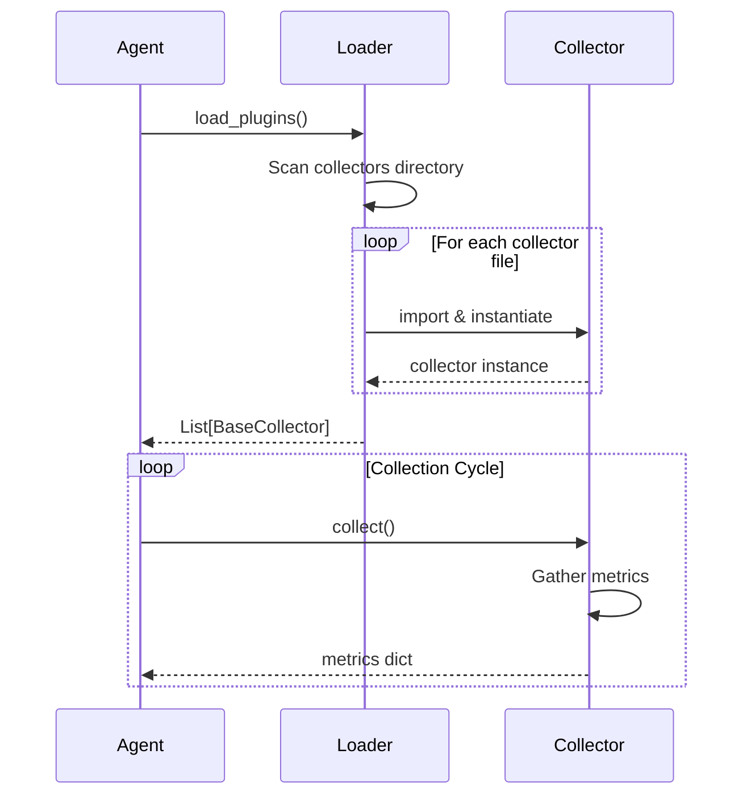

# Collectors System

> Complete guide to the NetMonitor collector system and plugin architecture

## 📖 Overview

Collectors are the data acquisition layer of NetMonitor. They gather raw telemetry from various sources and return structured metrics dictionaries.

**Key Features:**
- Plugin-based architecture
- Auto-discovery and loading
- Async execution
- Error isolation
- Extensible interface

---

## 🏗️ Architecture

### BaseCollector Interface

All collectors implement the `BaseCollector` abstract base class:

```python
# app/collectors/base.py

from abc import ABC, abstractmethod

class BaseCollector(ABC):
    """Base class for all metric collectors"""
    
    name: str  # Unique collector identifier
    
    @abstractmethod
    def collect(self) -> dict:
        """
        Collect metrics and return a dictionary.
        
        Returns:
            dict: Metrics with string keys and numeric values
        
        Example:
            {
                "latency": 15.3,
                "packet_loss": 0,
                "jitter": 2.1
            }
        """
        pass
```

### Plugin Discovery

Collectors are auto-loaded from the `app/collectors/` directory:

```python
# app/collectors/__init__.py

def load_plugins() -> List[BaseCollector]:
    """
    Dynamically discover and load all collector plugins.
    """
    collectors = []
    
    # Scan collectors directory
    collectors_dir = Path(__file__).parent
    
    for file in collectors_dir.glob("*.py"):
        if file.stem in ["__init__", "base"]:
            continue
        
        # Import module
        module = importlib.import_module(f"app.collectors.{file.stem}")
        
        # Find collector classes
        for name, obj in inspect.getmembers(module, inspect.isclass):
            if issubclass(obj, BaseCollector) and obj != BaseCollector:
                collectors.append(obj())
    
    return collectors
```

---

## 📊 Built-in Collectors

### PingCollector

Measures ICMP latency, packet loss, and jitter.

**Location:** `app/collectors/ping.py`

**Metrics Produced:**

| Metric | Unit | Description |
|--------|------|-------------|
| `latency` | ms | Round-trip time |
| `packet_loss` | % | Packet loss percentage |
| `jitter` | ms | Latency variation |
| `min_latency` | ms | Minimum observed latency |
| `max_latency` | ms | Maximum observed latency |
| `avg_latency` | ms | Average latency |

**Implementation:**

```python
# app/collectors/ping.py

import subprocess
import re
from app.collectors.base import BaseCollector
from app.utils.logger import logger

class PingCollector(BaseCollector):
    """ICMP ping-based latency collector"""
    
    name = "ping"
    
    def __init__(self):
        self.ping_count = 4
        self.timeout = 3
    
    def collect(self, target: str = "8.8.8.8") -> dict:
        """
        Ping target and extract metrics.
        
        Args:
            target: IP address or hostname to ping
        
        Returns:
            dict: Latency and packet loss metrics
        """
        try:
            # Execute ping command (platform-specific)
            if sys.platform == "win32":
                cmd = ["ping", "-n", str(self.ping_count), "-w", 
                       str(self.timeout * 1000), target]
            else:
                cmd = ["ping", "-c", str(self.ping_count), "-W", 
                       str(self.timeout), target]
            
            result = subprocess.run(
                cmd,
                capture_output=True,
                text=True,
                timeout=self.timeout + 2
            )
            
            if result.returncode != 0:
                logger.warning(f"Ping to {target} failed")
                return self._timeout_metrics()
            
            # Parse output
            return self._parse_ping_output(result.stdout, target)
        
        except subprocess.TimeoutExpired:
            logger.error(f"Ping to {target} timed out")
            return self._timeout_metrics()
        
        except Exception as e:
            logger.error(f"Ping collector error: {e}")
            return self._timeout_metrics()
    
    def _parse_ping_output(self, output: str, target: str) -> dict:
        """Parse platform-specific ping output"""
        metrics = {}
        
        # Parse packet loss
        loss_match = re.search(r"(\d+)% packet loss", output)
        if loss_match:
            metrics["packet_loss"] = float(loss_match.group(1))
        
        # Parse latency statistics (Windows)
        if sys.platform == "win32":
            stats_match = re.search(
                r"Minimum = (\d+)ms, Maximum = (\d+)ms, Average = (\d+)ms",
                output
            )
            if stats_match:
                metrics["min_latency"] = float(stats_match.group(1))
                metrics["max_latency"] = float(stats_match.group(2))
                metrics["avg_latency"] = float(stats_match.group(3))
                metrics["latency"] = metrics["avg_latency"]
                
                # Calculate jitter
                metrics["jitter"] = metrics["max_latency"] - metrics["min_latency"]
        
        # Parse latency statistics (Linux/macOS)
        else:
            stats_match = re.search(
                r"= ([\d.]+)/([\d.]+)/([\d.]+)/([\d.]+) ms",
                output
            )
            if stats_match:
                metrics["min_latency"] = float(stats_match.group(1))
                metrics["avg_latency"] = float(stats_match.group(2))
                metrics["max_latency"] = float(stats_match.group(3))
                metrics["latency"] = metrics["avg_latency"]
                
                # Standard deviation from ping output
                mdev = float(stats_match.group(4))
                metrics["jitter"] = mdev
        
        return metrics
    
    def _timeout_metrics(self) -> dict:
        """Return metrics indicating complete failure"""
        return {
            "latency": None,
            "packet_loss": 100,
            "jitter": None,
            "min_latency": None,
            "max_latency": None,
            "avg_latency": None
        }
```

**Configuration:**

```yaml
collectors:
  ping:
    enabled: true
    targets:
      - "8.8.8.8"
      - "1.1.1.1"
    count: 4
    timeout: 3
```

**Example Output:**

```python
{
    "latency": 15.3,
    "packet_loss": 0,
    "jitter": 2.1,
    "min_latency": 13.2,
    "max_latency": 17.4,
    "avg_latency": 15.3
}
```

---

### TrafficCollector

Collects network interface statistics.

**Location:** `app/collectors/traffic.py`

**Metrics Produced:**

| Metric | Unit | Description |
|--------|------|-------------|
| `bytes_sent` | bytes | Total bytes transmitted |
| `bytes_recv` | bytes | Total bytes received |
| `packets_sent` | count | Total packets transmitted |
| `packets_recv` | count | Total packets received |
| `errin` | count | Receive errors |
| `errout` | count | Transmit errors |
| `dropin` | count | Dropped incoming packets |
| `dropout` | count | Dropped outgoing packets |

**Implementation:**

```python
# app/collectors/traffic.py

import psutil
from app.collectors.base import BaseCollector
from app.utils.logger import logger

class TrafficCollector(BaseCollector):
    """Network interface traffic statistics collector"""
    
    name = "traffic"
    
    def __init__(self):
        self.interface = None  # None = all interfaces
    
    def collect(self) -> dict:
        """
        Collect network interface statistics.
        
        Returns:
            dict: Network traffic metrics
        """
        try:
            stats = psutil.net_io_counters(pernic=False)
            
            return {
                "bytes_sent": stats.bytes_sent,
                "bytes_recv": stats.bytes_recv,
                "packets_sent": stats.packets_sent,
                "packets_recv": stats.packets_recv,
                "errin": stats.errin,
                "errout": stats.errout,
                "dropin": stats.dropin,
                "dropout": stats.dropout
            }
        
        except Exception as e:
            logger.error(f"Traffic collector error: {e}")
            return {}
```

**Example Output:**

```python
{
    "bytes_sent": 1024000,
    "bytes_recv": 2048000,
    "packets_sent": 1500,
    "packets_recv": 2200,
    "errin": 0,
    "errout": 0,
    "dropin": 0,
    "dropout": 0
}
```

---

### IPerfCollector

Bandwidth testing using iperf3.

**Location:** `app/collectors/iperf.py`

**Metrics Produced:**

| Metric | Unit | Description |
|--------|------|-------------|
| `bandwidth_mbps` | Mbps | Measured bandwidth |
| `sent_bytes` | bytes | Bytes transmitted |
| `retransmits` | count | TCP retransmits |
| `jitter_ms` | ms | UDP jitter (UDP mode) |

**Prerequisites:**
- iperf3 installed: `pip install iperf3-python`
- iperf3 server running: `iperf3 -s`

**Implementation:**

```python
# app/collectors/iperf.py

import iperf3
from app.collectors.base import BaseCollector
from app.utils.logger import logger

class IPerfCollector(BaseCollector):
    """iperf3-based bandwidth testing collector"""
    
    name = "iperf"
    
    def __init__(self):
        self.server_host = "localhost"
        self.server_port = 5201
        self.duration = 5  # seconds
        self.protocol = "tcp"  # or "udp"
    
    def collect(self) -> dict:
        """
        Run iperf3 test and collect bandwidth metrics.
        
        Returns:
            dict: Bandwidth and performance metrics
        """
        try:
            client = iperf3.Client()
            client.server_hostname = self.server_host
            client.port = self.server_port
            client.duration = self.duration
            client.protocol = self.protocol
            
            result = client.run()
            
            if result.error:
                logger.error(f"iperf3 error: {result.error}")
                return {}
            
            metrics = {
                "bandwidth_mbps": result.sent_Mbps,
                "sent_bytes": result.sent_bytes,
            }
            
            if self.protocol == "tcp":
                metrics["retransmits"] = result.retransmits
            elif self.protocol == "udp":
                metrics["jitter_ms"] = result.jitter_ms
            
            return metrics
        
        except Exception as e:
            logger.error(f"iperf collector error: {e}")
            return {}
```

---

## 🔧 Creating Custom Collectors

### Step 1: Create Collector File

Create a new file in `app/collectors/`:

```python
# app/collectors/http_check.py

import requests
import time
from app.collectors.base import BaseCollector
from app.utils.logger import logger

class HTTPCheckCollector(BaseCollector):
    """HTTP endpoint availability and response time collector"""
    
    name = "http_check"
    
    def __init__(self):
        self.url = "https://api.example.com/health"
        self.timeout = 5
    
    def collect(self) -> dict:
        """
        Check HTTP endpoint and measure response time.
        
        Returns:
            dict: HTTP response metrics
        """
        try:
            start = time.time()
            response = requests.get(self.url, timeout=self.timeout)
            duration = (time.time() - start) * 1000  # ms
            
            return {
                "http_response_time_ms": duration,
                "http_status_code": response.status_code,
                "http_available": 1 if response.ok else 0
            }
        
        except requests.Timeout:
            logger.warning(f"HTTP check timeout: {self.url}")
            return {
                "http_response_time_ms": None,
                "http_status_code": 0,
                "http_available": 0
            }
        
        except Exception as e:
            logger.error(f"HTTP check error: {e}")
            return {
                "http_response_time_ms": None,
                "http_status_code": 0,
                "http_available": 0
            }
```

### Step 2: Auto-Discovery

Your collector will be automatically discovered and loaded! No registration needed.

### Step 3: Test Your Collector

```python
# Test standalone
from app.collectors.http_check import HTTPCheckCollector

collector = HTTPCheckCollector()
metrics = collector.collect()
print(metrics)
```

### Step 4: Integration

Restart NetMonitor—your collector is now active!

---

## 🎯 Best Practices

### 1. Error Handling

Always handle exceptions gracefully:

```python
def collect(self) -> dict:
    try:
        # Collection logic
        return metrics
    except Exception as e:
        logger.error(f"Collector {self.name} failed: {e}")
        return {}  # Return empty dict on failure
```

### 2. Timeouts

Set reasonable timeouts:

```python
def collect(self) -> dict:
    timeout = 5  # seconds
    result = operation(timeout=timeout)
```

### 3. Return Types

Always return dictionaries with numeric values:

```python
# Good
return {"latency": 15.3, "available": 1}

# Bad
return ["latency", 15.3]  # Not a dict
return {"latency": "15.3ms"}  # String value
```

### 4. Logging

Use appropriate log levels:

```python
logger.debug("Starting collection")  # Verbose
logger.info("Collection successful")  # Important events
logger.warning("Timeout occurred")  # Recoverable issues
logger.error("Critical failure")  # Failures
```

### 5. Performance

Keep collection fast:

```python
# Target: <1 second per collector
# Use async where possible
# Cache expensive operations
# Set reasonable timeouts
```

---

## 🧪 Testing Collectors

### Unit Test Example

```python
# tests/test_collectors.py

import pytest
from app.collectors.ping import PingCollector

def test_ping_collector():
    collector = PingCollector()
    metrics = collector.collect("8.8.8.8")
    
    assert "latency" in metrics
    assert "packet_loss" in metrics
    assert isinstance(metrics["latency"], float) or metrics["latency"] is None
    assert 0 <= metrics["packet_loss"] <= 100

def test_ping_timeout():
    collector = PingCollector()
    collector.timeout = 0.001  # Force timeout
    metrics = collector.collect("192.0.2.1")  # Non-routable
    
    assert metrics["packet_loss"] == 100
    assert metrics["latency"] is None
```

---

## 📊 Collector Lifecycle



---

## 🔗 Related Documentation

- **[Architecture](ARCHITECTURE.md)** - System design
- **[Plugin Development](PLUGIN_DEVELOPMENT.md)** - Advanced plugin creation
- **[Testing Guide](TESTING.md)** - Testing strategies
- **[API Reference](API.md)** - Metrics API