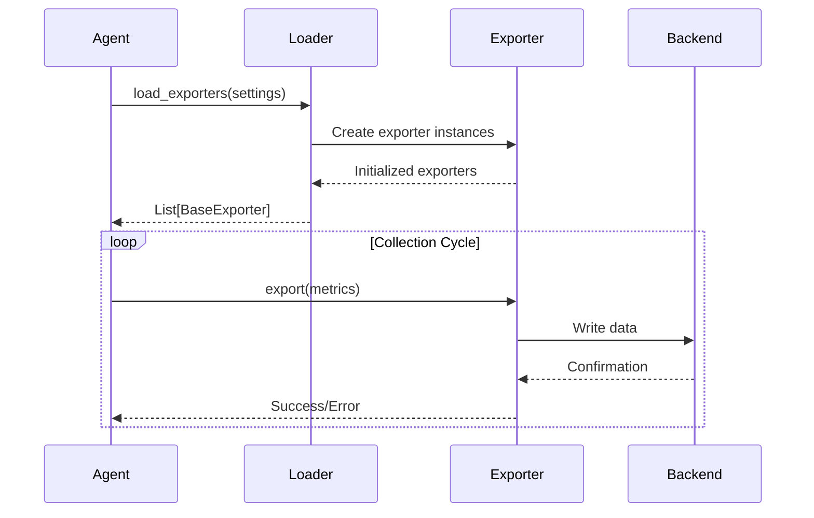

# Exporters Documentation

> Complete guide to NetMonitor's data export system

## 📤 Overview

Exporters are responsible for persisting metrics collected by NetMonitor to various backends. The system supports multiple exporters operating concurrently.

**Supported Exporters:**
- InfluxDB (time-series database)
- Prometheus (metrics exposition)
- Custom exporters (extensible)

---

## 🏗️ Architecture

### BaseExporter Interface

All exporters implement the `BaseExporter` abstract base class:

```python
# app/exporters/base.py

from abc import ABC, abstractmethod

class BaseExporter(ABC):
    """Base class for all metric exporters"""
    
    @abstractmethod
    def export(self, metrics: dict):
        """
        Export metrics to backend.
        
        Args:
            metrics: Dictionary of metric name-value pairs
        """
        pass
```

### Exporter Lifecycle



---

## 📊 InfluxDB Exporter

### Overview

InfluxDB is a time-series database optimized for metrics and events.

**Advantages:**
- Purpose-built for time-series data
- Efficient storage and queries
- Built-in downsampling
- Rich query language (Flux)
- Retention policies
- Ideal for historical analysis

### Configuration

```yaml
exporters:
  influx:
    enabled: true
    url: "http://localhost:8086"
    org: "net-monitor"
    bucket: "network"
    token_env: "INFLUX_TOKEN"
    batch_size: 100
    flush_interval: 1000  # milliseconds
```

### Setup

#### 1. Install InfluxDB

**Docker:**
```bash
docker run -d \
  -p 8086:8086 \
  -v influxdb-data:/var/lib/influxdb2 \
  influxdb:2.7
```

**Native:**
```bash
# Ubuntu/Debian
wget https://dl.influxdata.com/influxdb/releases/influxdb2-2.7.0-amd64.deb
sudo dpkg -i influxdb2-2.7.0-amd64.deb
sudo systemctl start influxdb

# macOS
brew install influxdb
brew services start influxdb
```

#### 2. Initialize InfluxDB

```bash
# Setup via CLI
influx setup \
  --username admin \
  --password changeme123 \
  --org net-monitor \
  --bucket network \
  --force

# Or visit http://localhost:8086
```

#### 3. Create API Token

```bash
# Create token with write access
influx auth create \
  --org net-monitor \
  --read-bucket network \
  --write-bucket network

# Output: Copy the token
```

#### 4. Configure NetMonitor

```bash
# Set token
export INFLUX_TOKEN="your-token-here"

# Enable in config
# app/config/config.yaml
exporters:
  influx:
    enabled: true
```

### Implementation Details

```python
# app/exporters/influx.py

import os
from datetime import datetime
from influxdb_client import InfluxDBClient, Point, WritePrecision
from influxdb_client.client.write_api import SYNCHRONOUS
from app.exporters.base import BaseExporter
from app.utils.logger import logger

class InfluxExporter(BaseExporter):
    """InfluxDB time-series exporter"""
    
    def __init__(self, settings):
        self.url = settings.exporters.influx.url
        self.org = settings.exporters.influx.org
        self.bucket = settings.exporters.influx.bucket
        
        # Get token from environment
        self.token = os.getenv("INFLUX_TOKEN")
        if not self.token:
            raise ValueError("INFLUX_TOKEN not set")
        
        # Initialize client
        self.client = InfluxDBClient(
            url=self.url,
            token=self.token,
            org=self.org
        )
        
        self.write_api = self.client.write_api(write_options=SYNCHRONOUS)
        logger.info("InfluxDB exporter initialized")
    
    def export(self, metrics: dict):
        """
        Export metrics to InfluxDB.
        
        Args:
            metrics: Dictionary of metrics
        """
        try:
            point = Point("network_metrics")
            
            # Add fields
            for key, value in metrics.items():
                if key == "agent_id":
                    # Add as tag for better querying
                    point = point.tag("agent_id", value)
                elif isinstance(value, (int, float)):
                    point = point.field(key, float(value))
            
            # Set timestamp
            point = point.time(datetime.utcnow(), WritePrecision.MS)
            
            # Write to InfluxDB
            self.write_api.write(
                bucket=self.bucket,
                org=self.org,
                record=point
            )
            
            logger.debug(f"Exported {len(metrics)} metrics to InfluxDB")
        
        except Exception as e:
            logger.error(f"InfluxDB export failed: {e}")
            raise
```

### Querying Data

**Flux Query Example:**
```python
from influxdb_client import InfluxDBClient

client = InfluxDBClient(url="http://localhost:8086", token=token, org="net-monitor")
query_api = client.query_api()

# Query last hour of latency data
query = '''
from(bucket: "network")
  |> range(start: -1h)
  |> filter(fn: (r) => r._measurement == "network_metrics")
  |> filter(fn: (r) => r._field == "latency")
  |> filter(fn: (r) => r.agent_id == "agent-001")
'''

tables = query_api.query(query)

for table in tables:
    for record in table.records:
        print(f"{record.get_time()}: {record.get_value()}ms")
```

### Data Retention

```bash
# Set retention policy
influx bucket update \
  --name network \
  --retention 7d  # Keep data for 7 days
```

---

## 📈 Prometheus Exporter

### Overview

Prometheus is a monitoring system with pull-based metric collection.

**Advantages:**
- Pull-based architecture
- Built-in service discovery
- Powerful query language (PromQL)
- Alerting integration
- Wide ecosystem support
- Federation capabilities

### Configuration

```yaml
exporters:
  prometheus:
    enabled: true
    port: 8000
    path: "/metrics"
    namespace: "netmonitor"
```

### Setup

#### 1. Enable Prometheus Exporter

```yaml
# app/config/config.yaml
exporters:
  prometheus:
    enabled: true
    port: 8000
```

#### 2. Configure Prometheus to Scrape

```yaml
# prometheus.yml
global:
  scrape_interval: 30s
  evaluation_interval: 30s

scrape_configs:
  - job_name: 'netmonitor'
    static_configs:
      - targets: ['localhost:8000']
        labels:
          environment: 'production'
          location: 'datacenter-1'
    
    scrape_interval: 30s
    scrape_timeout: 10s
```

#### 3. Start Prometheus

```bash
# Docker
docker run -d \
  -p 9090:9090 \
  -v ./prometheus.yml:/etc/prometheus/prometheus.yml \
  prom/prometheus

# Native
prometheus --config.file=prometheus.yml
```

#### 4. Verify Scraping

Visit http://localhost:9090/targets

### Implementation Details

```python
# app/exporters/prometheus.py

from prometheus_client import Gauge, Counter, Histogram
from app.exporters.base import BaseExporter
from app.utils.logger import logger

class PrometheusExporter(BaseExporter):
    """Prometheus metrics exporter"""
    
    def __init__(self):
        # Define metrics
        self.latency = Gauge(
            'network_latency_ms',
            'Network latency in milliseconds',
            ['agent_id']
        )
        
        self.packet_loss = Gauge(
            'network_packet_loss_percent',
            'Packet loss percentage',
            ['agent_id']
        )
        
        self.jitter = Gauge(
            'network_jitter_ms',
            'Network jitter in milliseconds',
            ['agent_id']
        )
        
        self.bytes_sent = Counter(
            'network_bytes_sent_total',
            'Total bytes sent',
            ['agent_id']
        )
        
        self.bytes_recv = Counter(
            'network_bytes_received_total',
            'Total bytes received',
            ['agent_id']
        )
        
        logger.info("Prometheus exporter initialized")
    
    def export(self, metrics: dict):
        """
        Update Prometheus metrics.
        
        Args:
            metrics: Dictionary of metrics
        """
        try:
            agent_id = metrics.get("agent_id", "unknown")
            
            # Update gauges
            if "latency" in metrics and metrics["latency"] is not None:
                self.latency.labels(agent_id=agent_id).set(metrics["latency"])
            
            if "packet_loss" in metrics:
                self.packet_loss.labels(agent_id=agent_id).set(metrics["packet_loss"])
            
            if "jitter" in metrics and metrics["jitter"] is not None:
                self.jitter.labels(agent_id=agent_id).set(metrics["jitter"])
            
            # Update counters
            if "bytes_sent" in metrics:
                self.bytes_sent.labels(agent_id=agent_id).inc(metrics["bytes_sent"])
            
            if "bytes_recv" in metrics:
                self.bytes_recv.labels(agent_id=agent_id).inc(metrics["bytes_recv"])
            
            logger.debug("Updated Prometheus metrics")
        
        except Exception as e:
            logger.error(f"Prometheus export failed: {e}")
```

### Available Metrics

```
# HELP network_latency_ms Network latency in milliseconds
# TYPE network_latency_ms gauge
network_latency_ms{agent_id="agent-001"} 15.3

# HELP network_packet_loss_percent Packet loss percentage
# TYPE network_packet_loss_percent gauge
network_packet_loss_percent{agent_id="agent-001"} 0.0

# HELP network_jitter_ms Network jitter in milliseconds
# TYPE network_jitter_ms gauge
network_jitter_ms{agent_id="agent-001"} 2.1

# HELP network_bytes_sent_total Total bytes sent
# TYPE network_bytes_sent_total counter
network_bytes_sent_total{agent_id="agent-001"} 1024000

# HELP network_bytes_received_total Total bytes received
# TYPE network_bytes_received_total counter
network_bytes_received_total{agent_id="agent-001"} 2048000
```

### PromQL Queries

**Average latency over 5 minutes:**
```promql
avg_over_time(network_latency_ms[5m])
```

**95th percentile:**
```promql
histogram_quantile(0.95, rate(network_latency_ms[5m]))
```

**Packet loss rate:**
```promql
rate(network_packet_loss_percent[5m])
```

---

## 🔧 Creating Custom Exporters

### Example: JSON File Exporter

```python
# app/exporters/json_file.py

import json
from datetime import datetime
from pathlib import Path
from app.exporters.base import BaseExporter
from app.utils.logger import logger

class JSONFileExporter(BaseExporter):
    """Export metrics to JSON file"""
    
    def __init__(self, output_path: str = "metrics.json"):
        self.output_path = Path(output_path)
        self.output_path.parent.mkdir(parents=True, exist_ok=True)
        logger.info(f"JSON file exporter: {self.output_path}")
    
    def export(self, metrics: dict):
        """
        Append metrics to JSON file.
        
        Args:
            metrics: Dictionary of metrics
        """
        try:
            # Read existing data
            if self.output_path.exists():
                with open(self.output_path, 'r') as f:
                    data = json.load(f)
            else:
                data = []
            
            # Add timestamp
            metrics["exported_at"] = datetime.utcnow().isoformat()
            
            # Append new metrics
            data.append(metrics)
            
            # Write back with pretty formatting
            with open(self.output_path, 'w') as f:
                json.dump(data, f, indent=2)
            
            logger.debug(f"Exported metrics to {self.output_path}")
        
        except Exception as e:
            logger.error(f"JSON file export failed: {e}")
```

### Example: CSV Exporter

```python
# app/exporters/csv_export.py

import csv
from pathlib import Path
from app.exporters.base import BaseExporter
from app.utils.logger import logger

class CSVExporter(BaseExporter):
    """Export metrics to CSV file"""
    
    def __init__(self, output_path: str = "metrics.csv"):
        self.output_path = Path(output_path)
        self.output_path.parent.mkdir(parents=True, exist_ok=True)
        self.headers_written = self.output_path.exists()
        logger.info(f"CSV exporter: {self.output_path}")
    
    def export(self, metrics: dict):
        """
        Append metrics to CSV file.
        
        Args:
            metrics: Dictionary of metrics
        """
        try:
            mode = 'a' if self.output_path.exists() else 'w'
            
            with open(self.output_path, mode, newline='') as f:
                writer = csv.DictWriter(f, fieldnames=metrics.keys())
                
                # Write headers if new file
                if not self.headers_written:
                    writer.writeheader()
                    self.headers_written = True
                
                writer.writerow(metrics)
            
            logger.debug(f"Exported metrics to {self.output_path}")
        
        except Exception as e:
            logger.error(f"CSV export failed: {e}")
```

### Registering Custom Exporter

```python
# app/exporters/manager.py

def load_exporters(settings):
    """Load configured exporters"""
    exporters = []
    
    # InfluxDB
    if settings.exporters.influx.enabled:
        from app.exporters.influx import InfluxExporter
        exporters.append(InfluxExporter(settings))
    
    # Prometheus
    if settings.exporters.prometheus.enabled:
        from app.exporters.prometheus import PrometheusExporter
        exporters.append(PrometheusExporter())
    
    # Custom: JSON File
    if settings.exporters.get("json_file", {}).get("enabled"):
        from app.exporters.json_file import JSONFileExporter
        exporters.append(JSONFileExporter())
    
    return exporters
```

---

## 📊 Exporter Comparison

| Feature | InfluxDB | Prometheus | Custom |
|---------|----------|------------|--------|
| Architecture | Push | Pull | Varies |
| Data Model | Time-series | Time-series | Flexible |
| Query Language | Flux | PromQL | Custom |
| Retention | Configurable | Configurable | Manual |
| Alerting | Via Kapacitor | Built-in | Manual |
| Federation | Yes | Yes | Custom |
| Best For | Historical analysis | Real-time monitoring | Special needs |

---

## 🔗 Related Documentation

- **[Configuration](CONFIGURATION.md)** - Exporter configuration
- **[Architecture](ARCHITECTURE.md)** - System design
- **[Deployment](DEPLOYMENT.md)** - Production deployment
- **[Monitoring](MONITORING.md)** - Observability setup